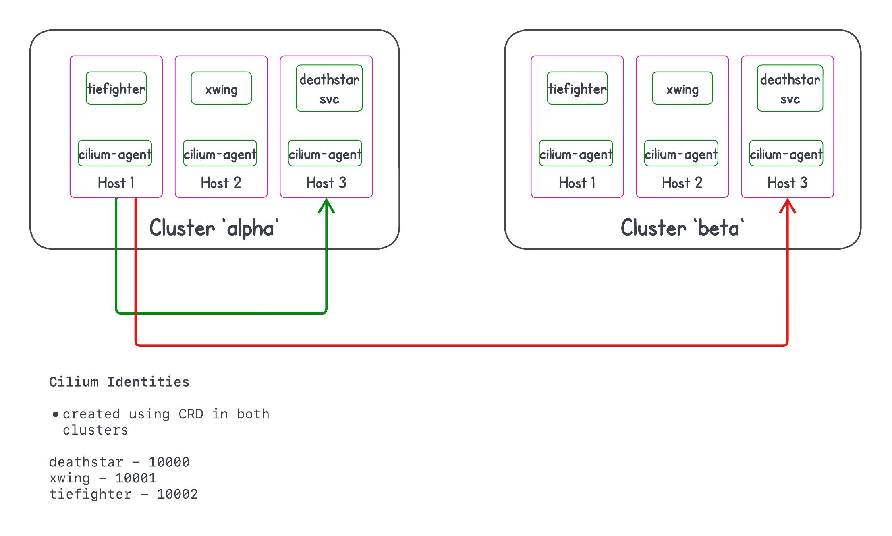

## Cilium Identity (CRD) Multicluster cluster Scenario.

### Steps
1. Created two clusters - `alpha` and `beta` as shown below. `cilium` (cilium-ebay) is installed in both clusters with the [config](./cilium-config-view.txt), mainly, `enable-high-scale-ipcache-decap-only=true` and `enable-policy=default`

2. In each cluster, 3 `CiliumIdentites` are created. Refer the CiliumIdentity specs [alpha](specs/identity-alpha.yaml) and [beta](specs/identity-beta.yaml)
    
        deatchstar-svc  - 10000
        xwing           - 10001
        tiefighter      - 10002  

3. 1 service and 2 pods are created in each cluster. [deployment spec](specs/deployment.yaml)

4. Verified the connectivity to invoke deathstar service. I am able to reach the service.

    1. `tiefighter in cluster alpha` ->  `deathstar-svc in cluster alpha`  (able to reach)
    2. `xwing in cluster alpha`      ->  `deathstar-svc in cluster alpha`  (able to reach)
    3. `tiefighter in cluster alpha` ->  `deathstar-svc in cluster beta`   (able to reach)
    4. `xwing in cluster alpha`      ->  `deathstar-svc in cluster beta`   (able to reach)
         
5. Create CiliumNetworkPolicy in both clusters. Only `tiefighter` can reach `deathstar-svc`. [cnp spec](specs/cnp.yaml)

6. Observed behaviour 

    1. `tiefighter in cluster alpha` ->  `deathstar-svc in cluster alpha` (able to reach)
    2. `xwing in cluster alpha`      ->  `deathstar-svc in cluster alpha` (not able to reach)
    3. `tiefighter in cluster alpha` ->  `deathstar-svc in cluster beta`  (not able to reach)
    4. `xwing in cluster alpha`      ->  `deathstar-svc in cluster beta`  (not able to reach)

#### Notes:

    1. I am using four security labels. If I remove one, cilium ends up creating a new one for the endpoint.
    2. ciliummesh-apiserver is not running.

## Questions

1.  `cilium` is running in `enable-high-scale-ipcache-decap-only=true`. How the cnp came into effect in `6.2` case?
2.  The reason for 6.3 and 6.4 behaviour is incoming cilium identity in host-3 of cluster-beta is `2` (world) instead of `10001`/`10002`. I found that using `cilium monitor` command. How it is changed to `2`?
